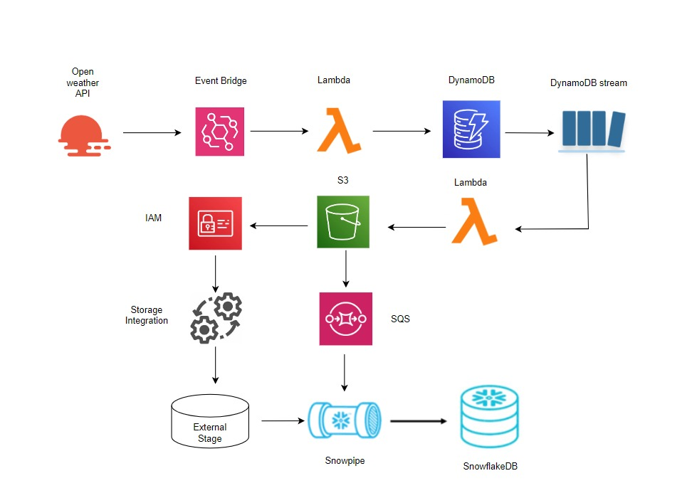

# 🌦️ Real-Time Weather Data Pipeline using AWS & Snowflake

---

# 📌 Project Overview

This project demonstrates a **real-time weather data engineering pipeline** built using AWS cloud services and Snowflake.

The pipeline fetches live weather data from the **OpenWeather API**, processes it using AWS services, stores raw and transformed data in **Amazon S3**, and automatically loads the data into **Snowflake** using **Snowpipe**.

This project showcases:

- Event-driven architecture
- Serverless data processing
- Cloud storage integration
- Automated data ingestion
- Real-time analytics workflow

---

# 🏗️ Architecture Diagram

The architecture flow is shown below:



### Workflow Steps

1. OpenWeather API provides weather data.
2. EventBridge triggers Lambda on schedule.
3. Lambda fetches and stores data in DynamoDB.
4. DynamoDB Streams capture new records.
5. Another Lambda processes stream data.
6. Processed data is stored in Amazon S3.
7. Snowpipe automatically ingests files from S3 into Snowflake.

---

# ⚙️ Tech Stack

## ☁️ AWS Services Used

- Amazon EventBridge
- AWS Lambda
- Amazon DynamoDB
- DynamoDB Streams
- Amazon S3
- Amazon SQS
- AWS IAM

---

## 🗄️ Database & Warehousing

- Snowflake
- Snowpipe
- External Stage
- Storage Integration

---

## 🧑‍💻 Programming Language

- Python

---

# 🔄 Complete Workflow

## Step 1 — Fetch Weather Data

Amazon EventBridge triggers the first Lambda function at scheduled intervals.

The Lambda function:

- Connects to OpenWeather API
- Fetches live weather data
- Converts response into JSON
- Stores records into DynamoDB

---

## Step 2 — DynamoDB Stream Trigger

Whenever new data is inserted into DynamoDB:

- DynamoDB Streams capture the change event
- A second Lambda function is triggered automatically

This Lambda:

- Reads the stream event
- Cleans and formats data
- Creates structured JSON files
- Uploads files into Amazon S3

---

## Step 3 — Snowflake Integration

Snowflake connects to Amazon S3 using:

- IAM Role
- Storage Integration
- External Stage

Snowpipe continuously monitors S3.

When new files arrive:

- Snowpipe automatically loads data into Snowflake tables
- Real-time ingestion is completed

---

# 📂 Project Structure

```bash
WEATHER_PIPELINE/
│
├── lambda_fetch/
│   ├── lambda_function.py
│
├── lambda_stream/
│   ├── lambda_stream.py
│
├── snowflake/
│   ├── weatherproject.sql
│
├── assets/
│   ├── weather-pipeline.png.png
│
├── .gitignore
├── README.md
│
└── deploy.yml
```

---

# 🔐 IAM Permissions Required

The following permissions are required:

- DynamoDB Full Access
- S3 Access
- Lambda Execution Role
- CloudWatch Logs
- SQS Access
- Snowflake Storage Integration Permissions

---

# 🚀 Features

✅ Real-time weather data ingestion  
✅ Event-driven serverless pipeline  
✅ Automated Snowflake loading  
✅ Fully scalable architecture  
✅ Cloud-native workflow  
✅ End-to-end AWS integration

---

# 🧪 Sample Use Cases

- Weather analytics
- Real-time ETL learning
- Cloud data engineering projects
- Snowflake integration practice
- AWS serverless architecture demo

---

# 🛠️ Setup Instructions

## 1️⃣ Clone Repository

```bash
git clone https://github.com/your-username/weather-data-pipeline.git
cd weather-data-pipeline
```

---

## 2️⃣ Configure AWS Services

Create:

- DynamoDB Table
- S3 Bucket
- Lambda Functions
- EventBridge Rule
- IAM Roles
- SQS Queue

---

## 3️⃣ Configure Snowflake

Create:

- Database
- Schema
- Storage Integration
- External Stage
- Snowpipe
- Target Tables

---

## 4️⃣ Deploy Lambda Functions

Zip and upload the Lambda functions:

```bash
zip -r function.zip .
```

Deploy through AWS Console or AWS CLI.

---

# 📈 Learning Outcomes

This project helps in understanding:

- AWS serverless architecture
- Event-driven systems
- Real-time streaming pipelines
- Snowflake ingestion workflows
- Cloud-native ETL pipelines

---